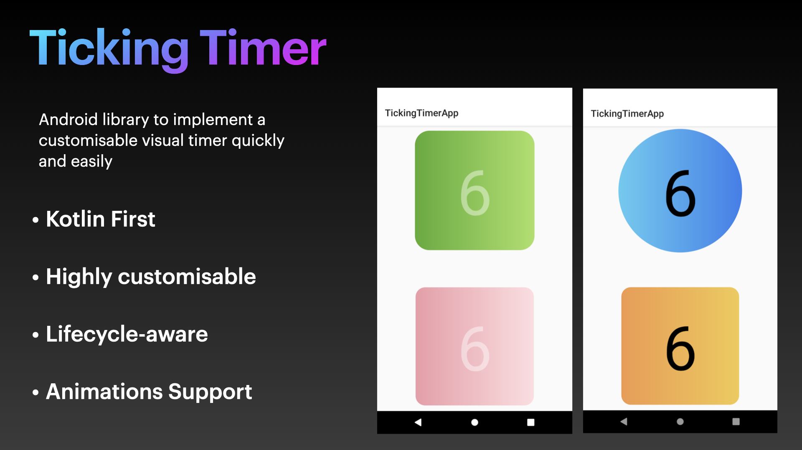
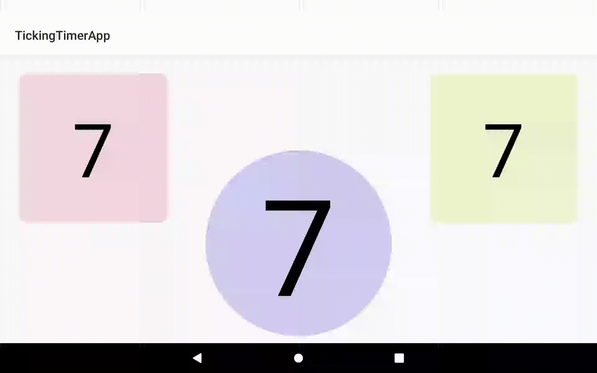

# Introduction [](https://saythanks.io/to/sidhuparas)

Ticking Timer is an Android library to implement a visual timer quickly, easily and effortlessly. It's developed to be Kotlin-first and you can implement the features in a very small amount of code.



### **Star :star:  this repo to show your support and it really does matter!** :clap:

# Integration

1. In the project-level `build.gradle`:

```
allprojects {
   repositories {
      ...
      maven { url 'https://jitpack.io' }
    }
}
```

2. In app-level `build.gradle`: [](https://jitpack.io/#sidhuparas/TickingTimer)

```
dependencies {
     implementation 'com.github.sidhuparas:TickingTimer:<latest-version>'
}
```



# How To Use?

1. Add the timer in XML and specify width and height. TickingTimer currently doesn't support feature-specific XML attributes.

```
<com.parassidhu.tickingtimer.TickingTimer
        android:id="@+id/timerView"
        android:layout_width="250dp"
        android:layout_height="250dp" />
```

2. Start the timer in Java/Kotlin code:

```
    timerView.start() // Without any customization
```
or
```
    timerView.start {
        textSize(20)
        shape(Shape.CIRCLE)
        backgroundTint(Color.parseColor(Color.BLACK))
    }
```
# Customizations

| Function | Parameter(s) | Description |
| ------ | ------- |------ |
| timerDuration() | duration (Int) | Duration for which timer should run
| backgroundTint() | color (Int?) | Colored tint for the background. If null is passed, tint is removed
| customBackground() | resource (@DrawableRes res: Int)  | Custom background for the background provided as a drawable
| shape() | shape (Shape) | Set background shape from predefined: CIRCLE, ROUNDED and CIRCLE. Doesn't apply if customBackground is applied after calling this function
| textSize() | size (Int) | Timer duration text size in sp (scaled-pixels)
| textColor() | color (Int) | Timer duration text color
| textAppearance() | resId (Int) | Use for custom styling of the text. Pass the style resource Id
| onFinished() | lambda () | Lambda callback executed when timer finishes
| onTick() | lambda (Int) | Lambda executed on every second elapsed and provides remaining time
| timerAnimation() | animation (Animation) | Custom timer animation
| timerEndAnimation() | lambda (View) | Lambda exposes View and is executed on timer end. Perform end animation on the view here
| applyConfig() | config (Config?) | Pass a config object to apply above properties in one go|
| cancel() | N/A | Cancels the timer. Automatically gets called on onDestroy() of the activity/fragment

# Saving Properties

To save the properties of the timer to reuse, you can use a Config object. Create config like this:

```
   val config = TickingTimer.defaultConfig().apply {
        timerDuration = 10
        textSize = 50
        textColor = Color.BLACK
        shape = Shape.ROUNDED
        customBackground = R.drawable.bg_grad_blue
   }
```

and then apply to the timer while starting:

`timerView.start(config)`

Another way to use the config is to use `applyConfig()` function:

```
   timerView.start {
        applyConfig(config)
        shape(Shape.CIRCLE)
        timerAnimation(ScaleAnimation(this@MainActivity, null))
        customBackground(R.drawable.bg_grad_orange)
   }
```

Remember that the properties defined after `applyConfig()` overrides the config's properties for the specific timer.

## Contributions

- Fork the repo
- Create a new branch and make changes
- Push the code to the branch and make a PR! :thumbsup:

# License

MIT License

Copyright (c) 2020 Paras Sidhu

Permission is hereby granted, free of charge, to any person obtaining a copy
of this software and associated documentation files (the "Software"), to deal
in the Software without restriction, including without limitation the rights
to use, copy, modify, merge, publish, distribute, sublicense, and/or sell
copies of the Software, and to permit persons to whom the Software is
furnished to do so, subject to the following conditions:

The above copyright notice and this permission notice shall be included in all
copies or substantial portions of the Software.

THE SOFTWARE IS PROVIDED "AS IS", WITHOUT WARRANTY OF ANY KIND, EXPRESS OR
IMPLIED, INCLUDING BUT NOT LIMITED TO THE WARRANTIES OF MERCHANTABILITY,
FITNESS FOR A PARTICULAR PURPOSE AND NONINFRINGEMENT. IN NO EVENT SHALL THE
AUTHORS OR COPYRIGHT HOLDERS BE LIABLE FOR ANY CLAIM, DAMAGES OR OTHER
LIABILITY, WHETHER IN AN ACTION OF CONTRACT, TORT OR OTHERWISE, ARISING FROM,
OUT OF OR IN CONNECTION WITH THE SOFTWARE OR THE USE OR OTHER DEALINGS IN THE
SOFTWARE.
